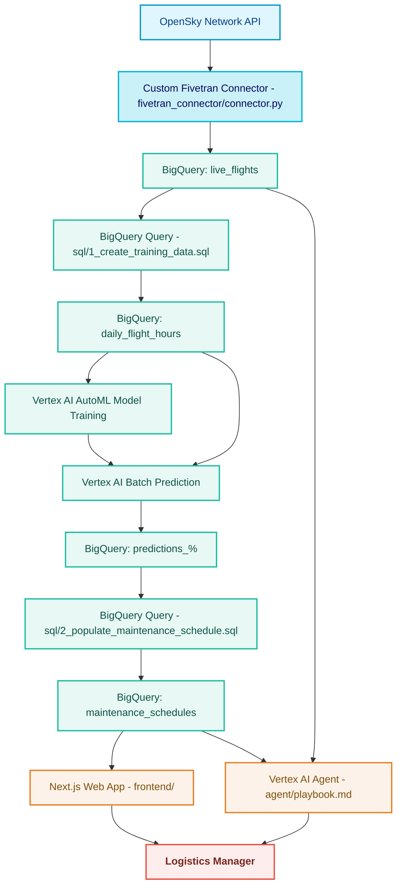

# 📍 AeroTrack AI: System Architecture

This document details the end-to-end pipeline from live data ingestion to predictive maintenancescheduling and user-facing outputs.
It is grounded in the repository’s current code and SQL artifacts and describes how external managed services (BigQuery, Vertex AI) are used to complete the pipeline.

## High-Level Flow



---

## End-to-End Sequence

### 1) Data Ingestion — Fivetran (Python SDK)

- A custom connector fetches live flight state vectors from the OpenSky Network API and prepares them for upsert into a `live_flights` table.

Key implementation: [fivetran_connector/connector.py](cci:7://file:///c:/Users/vidit/Desktop/Projects/AeroTrackAI/fivetran_connector/connector.py:0:0-0:0)

```py
# connector.py
import requests
from fivetran_connector_sdk import Connector, Operations as op, Logging as log
from datetime import datetime, timezone

API_ENDPOINT = "https://opensky-network.org/api/states/all"
MAX_FLIGHTS = 300  # Limit for hackathon/demo
```

Schema definition (primary key: `icao24`):

```py
def schema(configuration: dict):
    log.info("Defining schema for the 'live_flights' table.")
    return [
        {
            "table": "live_flights",
            "primary_key": ["icao24"],
            "columns": {
                "icao24": "STRING",
                "callsign": "STRING",
                "origin_country": "STRING",
                "time_position": "UTC_DATETIME",....
```

Configuration stubs: [fivetran_connector/config.json](cci:7://file:///c:/Users/vidit/Desktop/Projects/AeroTrackAI/fivetran_connector/config.json:0:0-0:0)

```json
{
  "api_url": "https://opensky-network.org/api/states/all",
  "flight_limit": "300"
}
```

Notes:
- Connector imports at runtime: `requests`, `fivetran_connector_sdk`.
- Demo cap via `MAX_FLIGHTS = 300`.

---

### 2) Warehousing & Transformation — Google BigQuery

- BigQuery is the single source of truth. The first transformation aggregates daily flight hours as model training data.

Training data build: [sql/1_create_training_data.sql](cci:7://file:///c:/Users/vidit/Desktop/Projects/AeroTrackAI/sql/1_create_training_data.sql:0:0-0:0)

```sql
CREATE OR REPLACE TABLE `aerotrack_ai_connector.daily_flight_hours` AS
SELECT
  icao_24,
  DATE(last_contact) AS flight_date,
  TIMESTAMP_DIFF(MAX(last_contact), MIN(last_contact), SECOND) / 3600.0 AS total_flight_hours
FROM
  `aerotrack_ai_connector.live_flights`
WHERE
  on_ground = FALSE
GROUP BY
  icao_24,
  flight_date
ORDER BY
  icao_24,
  flight_date;
```

Important alignment detail:
- The connector emits `icao24` (no underscore).
- The SQL expects `icao_24` (with underscore).
- A mapping or view is required at deployment to align these fields.

---

### 3) Predictive Analytics — Vertex AI AutoML (Time-Series)

- A Vertex AI AutoML time-series model is trained on `daily_flight_hours` to forecast future flight hours per aircraft.
- A recurring Vertex AI Batch Prediction job writes results to timestamped `predictions_%` tables in BigQuery.

Evidence path in repo:
- The downstream scheduling query dynamically discovers the latest `predictions_%` table (see next section).

Note:
- Model training and batch prediction orchestration live in managed Vertex AI; they are not part of this repository’s codebase.

---

### 4) Scheduling Logic — BigQuery Scheduled Query

- An idempotent insert process converts predictions into actionable maintenance tasks.
- It uses a deliberate `INSERT ... WHERE NOT EXISTS` (hackathon shortcut) to avoid duplicates and ensure demo reliability.

Scheduling query: [sql/2_populate_maintenance_schedule.sql](cci:7://file:///c:/Users/vidit/Desktop/Projects/AeroTrackAI/sql/2_populate_maintenance_schedule.sql:0:0-0:0)

```sql
EXECUTE IMMEDIATE FORMAT("""
INSERT INTO `aerotrack_ai_connector_us_central1.maintenance_schedules`
(icao_24, required_maintenance_type, last_serviced_date, status)
SELECT
    source.icao_24,
    CASE
        WHEN source.predicted_total_flight_hours.value >= 5 THEN 'D-Check'
        WHEN source.predicted_total_flight_hours.value >= 4 THEN 'C-Check'
        WHEN source.predicted_total_flight_hours.value >= 3 THEN 'B-Check'
        WHEN source.predicted_total_flight_hours.value >= 1 THEN 'A-Check'
        ELSE 'A-Check'
    END AS required_maintenance_type,
    CAST(NULL AS DATE) AS last_serviced_date,
    'Needs Maintenance' AS status
FROM
    `aerotrack_ai_connector_us_central1.%s` AS source
WHERE
    source.icao_24 IS NOT NULL
    AND source.predicted_total_flight_hours.value IS NOT NULL
    AND NOT EXISTS (
        SELECT 1
        FROM `aerotrack_ai_connector_us_central1.maintenance_schedules` AS target
        WHERE target.icao_24 = source.icao_24
        AND target.required_maintenance_type = CASE
            WHEN source.predicted_total_flight_hours.value >= 5 THEN 'D-Check'
            WHEN source.predicted_total_flight_hours.value >= 4 THEN 'C-Check'
            WHEN source.predicted_total_flight_hours.value >= 3 THEN 'B-Check'
            WHEN source.predicted_total_flight_hours.value >= 1 THEN 'A-Check'
            ELSE 'A-Check'
        END
    )
LIMIT 100;
""", latest_prediction_table);
```

Key properties:
- Latest predictions are resolved dynamically via `INFORMATION_SCHEMA`.
- Insert-only semantics with `NOT EXISTS` provide idempotency.
- Demo thresholds map predicted hours to check types (A/B/C/D).
- `LIMIT 100` bounds each run for demo control.

---

### 5) Application Layer — Next.js Frontend

- The web app provides dashboards and manager workflows. This repository includes a scaffold with setup docs.

Indicators in repo: [frontend/](cci:7://file:///c:/Users/vidit/Desktop/Projects/AeroTrackAI/frontend:0:0-0:0)

```json
{
  "name": "aerotrack-ai-frontend",
  "scripts": {
    "dev": "next dev",
    "build": "NEXT_TELEMETRY_DISABLED=1 next build",
    "start": "next start"
  },
  "dependencies": {
    "next": "15.5.6",
    "react": "19.1.0",
    "react-dom": "19.1.0"
  }
}
```

Supporting docs and templates:
- [frontend/DIALOGFLOW_SETUP.md](cci:7://file:///c:/Users/vidit/Desktop/Projects/AeroTrackAI/frontend/DIALOGFLOW_SETUP.md:0:0-0:0)
- [frontend/DIALOGFLOW_AGENT_SETUP.md](cci:7://file:///c:/Users/vidit/Desktop/Projects/AeroTrackAI/frontend/DIALOGFLOW_AGENT_SETUP.md:0:0-0:0)
- [frontend/DIALOGFLOW_CX_SETUP.md](cci:7://file:///c:/Users/vidit/Desktop/Projects/AeroTrackAI/frontend/DIALOGFLOW_CX_SETUP.md:0:0-0:0)
- [frontend/VERCEL_SETUP.md](cci:7://file:///c:/Users/vidit/Desktop/Projects/AeroTrackAI/frontend/VERCEL_SETUP.md:0:0-0:0)
- [frontend/env.template](cci:7://file:///c:/Users/vidit/Desktop/Projects/AeroTrackAI/frontend/env.template:0:0-0:0)

Deployment and UI composition details live in the frontend folder. The frontend consumes the `maintenance_schedules` table and related data to display AI-inferred maintenance actions.

---

### 6) Conversational AI — Agent Behavior

- Agent guidance and expected behavior are documented in [agent/playbook.md](cci:7://file:///c:/Users/vidit/Desktop/Projects/AeroTrackAI/agent/playbook.md:0:0-0:0).
- Emphasis on helpful defaults, fuzzy matching, and inclusive results (do not drop rows with `last_serviced_date = NULL`).

Excerpt: [agent/playbook.md](cci:7://file:///c:/Users/vidit/Desktop/Projects/AeroTrackAI/agent/playbook.md:0:0-0:0)

```md
- Use ${TOOL:Data-extraction_} to query the database for relevant aircraft, maintenance, or scheduling data.
- When retrieving maintenance records, include rows even if last_serviced_date is null.
- Always use fuzzy/approximate matching ... “A check”, “A-check”, “ACheck” treated as equivalent ...
- Present results in a clean table with headers like: ICAO24, Last Serviced Date, Maintenance Type, Status.
```

Note:
- Frontend docs include Dialogflow setup paths; the architecture anticipates a data-aware conversational layer connected to BigQuery-backed tables for natural-language Q&A.

---

## Key Data Models and Alignment

- **`live_flights`** (connector output schema): see [schema()](cci:1://file:///c:/Users/vidit/Desktop/Projects/AeroTrackAI/fivetran_connector/connector.py:29:0-55:5) in [fivetran_connector/connector.py](cci:7://file:///c:/Users/vidit/Desktop/Projects/AeroTrackAI/fivetran_connector/connector.py:0:0-0:0).
- **`daily_flight_hours`**: materialized via [sql/1_create_training_data.sql](cci:7://file:///c:/Users/vidit/Desktop/Projects/AeroTrackAI/sql/1_create_training_data.sql:0:0-0:0).
- **`predictions_%`**: written by Vertex AI Batch Prediction (external to repo; discovered dynamically by SQL).
- **`maintenance_schedules`**: populated by [sql/2_populate_maintenance_schedule.sql](cci:7://file:///c:/Users/vidit/Desktop/Projects/AeroTrackAI/sql/2_populate_maintenance_schedule.sql:0:0-0:0).

Alignment note:
- `icao24` (connector) vs `icao_24` (SQL). A view, alias, or transform is needed to reconcile at runtime.

---

## Operational Considerations

- **Idempotency:** Achieved via `INSERT ... WHERE NOT EXISTS` to prevent duplicate maintenance tasks across runs.
- **Environment specificity:** Project/dataset names in SQL (e.g., `aerotrack_ai_connector` and `_us_central1`) are environment-bound and should be parameterized for production.
- **Throughput limit:** `MAX_FLIGHTS = 300` caps ingestion for demo stability.
- **Dependencies:** Connector imports `requests` and `fivetran_connector_sdk`; ensure they’re available in the connector runtime.

---

## Appendix: Sample Data Artifact

[fivetran_connector/maintenance_schedules.csv](cci:7://file:///c:/Users/vidit/Desktop/Projects/AeroTrackAI/fivetran_connector/maintenance_schedules.csv:0:0-0:0)

```csv
icao24,required_maintenance_type,last_serviced_date
a83565,A-Check,2025-08-15
ac4f32,B-Check,2025-07-22
406a77,A-Check,2025-09-01
```

This file provides sample rows for local testing and UI scaffolding.

